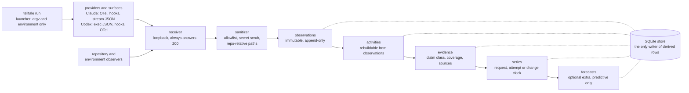

<p align="center">
  <picture>
    <source media="(prefers-color-scheme: dark)" srcset="docs/assets/wordmark-dark.svg">
    
  </picture>
</p>

<p align="center">
  A flight recorder for coding agents. Every number carries its claim class.
</p>

<p align="center">
  <a href="https://github.com/0xfauzi/telltale/actions/workflows/ci.yml"></a>
  
  
  
  
  
  <a href="LICENSE"></a>
</p>

A telltale is a short length of yarn a sailor tapes to a sail. You cannot see the wind, so
you read the yarn instead. This project does the same thing for a coding agent: you cannot
see what the agent was doing, so it reads the traces the agent already emits.

## The goals, what was measured, and what is left

**Goal 1: record what a coding agent did, without keeping anything sensitive.** Every tool
call, file touched, command run, test result, token spent, compaction and commit. Not the
prompt, the reply, the contents of an edit or the output of a command. No global
configuration file is edited and no model traffic is read.

**Goal 2: use that record to see what is coming.** How expensive this session will be,
whether the next test run will fail, whether this change will need rework after it merges,
whether the agent is stuck.

### Goal 1 is done

Six of the seven build stages passed their exit check (Research status below). 1,841
Claude sessions and 1,459 Codex sessions were read off this machine's disk into the store,
and Telltale recorded its own construction while it was being built.

### Goal 2 is mostly a negative result, and the negative result is the finding

**How every forecasting claim here is tested.** Cut the history at some point, forecast the
next step, compare against what actually happened. Then do the same with four rules of
thumb: repeat the last value, the median of the recent window, the mean of the recent
window, and a local trend line. If the forecasting model does not beat the best rule of
thumb by a margin decided in advance, on a share of attempts decided in advance, the
verdict is that the rule of thumb was good enough. In the write-ups that verdict is called
"baseline sufficient". The bar is always written down before the run, so a disappointing
result cannot be talked into a good one afterwards.

| The question | What was measured | What came back |
|---|---|---|
| How many tokens will the agent's next request use? | 594 Claude sessions and every Codex session on disk, 596 separate backtests, tens of thousands of forecast windows ([write-up](docs/experiments/E13.md), [and for Codex](docs/experiments/E13b.md)) | The rules of thumb were good enough every time. [Shuffling a session's history into random order](docs/experiments/E08.md) barely changed the errors, which says the order of these numbers carries almost no information. That is a fact about the quantity, not a failure of the model. |
| After a change merges: how long will its checks take, will they fail, will it be reworked soon after? | 657 merged commits across four of the owner's repositories ([write-up](docs/experiments/E16.md)) | Rules of thumb again, in all 12 cases. The model won 53 percent of the attempts where 60 percent was the bar set beforehand. |
| Does knowing the change's own size and shape (files touched, lines added and removed, tests touched) sharpen that forecast? | The same 657 commits, forecast twice and compared attempt by attempt ([write-up](docs/experiments/E16.md)) | 1 of the 11 answerable cases improved. 10 showed nothing measurable at this amount of data. The one that moved is recorded and not built on. |
| Can you tell early how expensive a session will be? | 545 sessions, judged on sessions the model had not seen ([write-up](docs/experiments/E15.md)) | Yes. After 16 requests, the remaining output tokens are estimated with 44 percent less error than guessing the average, and sessions rank in roughly the right order (0.70). The typical miss is still a factor of three, so it says "this one is big", not how big. |
| Do failures come in clusters? | The same 545 sessions ([write-up](docs/experiments/E15.md)) | Yes. After a verification fails, the next one fails 30 percent of the time, against 3 percent otherwise. Real, but not yet strong enough to interrupt somebody with. |

The short version: **what an agent is about to spend is partly knowable; what happens to
the code afterwards is not, so far, beyond a one-line rule of thumb.**

### What is still open, and why the daemon is running

One question has never been asked with data at all. Call it: **does how the agent worked
tell you anything about whether the change causes trouble later?**

Every finished change has two halves in the record.

- **The change half**: which files, how big, did the checks pass, was it reworked soon
  after. This can be read out of git and GitHub for any repository, at any time, going
  backwards.
- **The session half**: how many tokens the agent spent, how often its context was
  compacted, how many times it ran the tests and they failed. This exists only if Telltale
  was recording while the work was happening. It cannot be reconstructed later. Nobody
  writes it down anywhere else.

Of the 657 change rows measured so far, 5 have the session half. Every other row came out
of git history, where that half does not exist. So the question has no answer yet, not
because it was hard, but because the data was never collected.

That is what the daemon is for. Day-to-day capture was switched on 2026-09-06 and the
daemon has run as a background agent since 2026-09-07. Now every session that commits
inside a git checkout leaves behind a change with both halves filled in. They accrue at
the speed of ordinary work and there is no way to hurry them: 5 captured commits in the
first two days. 36 of them on a single repository are needed before the question can
be scored at all, and the rule for scoring them is
[written down in advance](docs/experiments/E17.md).

Three things the daemon still does not capture, all recorded in
[`docs/gates/wave-9.md`](docs/gates/wave-9.md): a session started by hand has no recorded
environment, Codex sessions do not yet bind to a repository, and Codex's metrics arrive
without a session attached.

The full report is [`docs/gates/final-report.md`](docs/gates/final-report.md); each
experiment's decision file is under [`docs/experiments/`](docs/experiments/).

## What Telltale is

Telltale records what a coding agent did, from the surfaces the agent already exposes. It
launches Claude Code or Codex for you, listens on a loopback port for the OpenTelemetry
logs and metrics, the lifecycle hooks and the structured stream output those tools already
produce, and adds its own observations of the repository and the execution environment. No
model traffic is intercepted and no global configuration is edited: the settings that
switch capture on travel with the launched process and disappear when it exits.

It keeps facts, not content. A tool name, a token count, a repo-relative path, a
normalized command, a diff statistic, a compaction event and an exit code are facts. The
prompt, the assistant's reply, the contents of an edit, the output of a command and the
value of an environment variable are content, and none of them is written at any capture
level. What survives is enough to reconstruct what happened and not enough to reconstruct
what was said.

Every derived number carries a claim class, so nobody downstream can present it as
stronger evidence than the layer that produced it. `derived` means computed from this
capture's own observations. `comparative` means two captures, or a capture and a cohort,
placed side by side. `associative` means two things moved together, which is not a
statement about cause. `predictive` means a forecaster produced it. A claim class is never
upgraded, a report may narrow a claim or drop it, and a value that was never observed
stays unknown rather than becoming zero, so "no compactions happened" and "this surface
cannot see compaction" remain different answers.

## What it is not

- Not a quality score, a difficulty score, or any other hidden latent label for a session,
  a change or a module. There is no `quality_score` and no `difficulty_score` anywhere.
- Not a causal system. Ordinary observational capture supports no causal claim, and the
  words cause, impact and would are refused in forecast output.
- Not a prompt or code archive. Prompt text, assistant text, tool result bodies, edit
  contents, command output and environment variable values are never persisted.
- Not a proxy or an interceptor. Telltale never sits between the agent and the model, and
  never reads model traffic.
- Not a cloud service. One local process, a SQLite file, and nothing leaves the machine.

## Quickstart

Every command below is real, run in order in a fresh clone under a temporary `HOME` and
`TELLTALE_HOME`; nothing is invented or assumed to still work.

```console
$ uv sync
$ uv run telltale --version
0.0.1
```

`telltale doctor` round-trips a synthetic event through every receiver endpoint and reports
what came back, rather than assuming success:

```console
$ uv run telltale doctor
SURFACE               RESULT  OBSERVED
--------------------  ------  -------------------------
otel_logs              ok     claude.otel.api_request
otel_metrics           ok     claude.otel.metric
hook                   ok     claude.hook.SessionEnd
stream                 ok     claude.stream.system.init
correlations           ok     external.correlation
outcomes               ok     external.outcome
policy_interventions   ok     policy.intervention
daemon_port            ok     port 47311 free

doctor: 8 surfaces round-trip
```

`telltale run` launches any command after `--`, wraps it with a capture, and never changes
its output bytes or its exit code. The same command wraps `claude -p ...` or
`codex exec ...`; here it wraps `bash`, so this transcript needs no agent session and spends
no tokens:

```console
$ uv run telltale run -- bash -c 'echo hello; exit 0'
hello
$ uv run telltale sessions
CAPTURE_ID                      PROVIDER  RUNTIME  MODEL  STARTED              DURATION_MS  OBSERVATIONS  COVERAGE  COMMITS  BACKFILL
------------------------------  --------  -------  -----  -------------------  -----------  ------------  --------  -------  --------
cap_01M1Q6R92KQPHD0J7RKXAHKMTM  generic   -        -      2026-09-04 21:56:16  220          5             -        0        no
```

`telltale show` is the session summary, `telltale timeline` is its activities in order, and
`telltale explain` walks one metric back to the observations that produced it; the
capture id in each is the one `sessions` printed, and yours will differ. A `generic`
capture of a plain shell command carries no model, tool or file facts, so most fields below
read `null`: that is the unknown-stays-unknown rule working, not a bug. `show` prints every
field in "What gets stored" below; this is an abridged excerpt of real output, not the
whole object.

```console
$ uv run telltale show cap_01M1Q6R92KQPHD0J7RKXAHKMTM
{
  "capture_id": "cap_01M1Q6R92KQPHD0J7RKXAHKMTM",
  "session": {"provider": "generic", "models": null, "duration_ms": 120.034},
  "usage": {"model_requests": null, "output_tokens": null},
  "work": {"max_diff_lines": 0, "final_diff_lines": 0},
  "claim_class": "derived"
  ...
}
$ uv run telltale timeline cap_01M1Q6R92KQPHD0J7RKXAHKMTM
TIME  TYPE           ACTOR     NAME           DURATION_MS  OUTCOME  CLAIM
----  -------------  --------  -------------  -----------  -------  -------
-     lifecycle      telltale  capture        -            -        derived
-     lifecycle      agent     capture_start  -            -        derived
-     repo_snapshot  telltale  capture_end    -            -        derived
-     lifecycle      agent     capture_end    -            ok       derived
$ uv run telltale explain cap_01M1Q6R92KQPHD0J7RKXAHKMTM max_diff_lines
metric           max_diff_lines
value            0 lines
claim_class      derived
coverage         observed
sources          1
```

### Day-to-day capture

`telltale run` wraps a session you launch. For the sessions you start yourself, run the
receiver and paste the snippets:

```console
$ uv run telltale setup claude --print
$ uv run telltale setup codex --print
$ uv run telltale daemon
```

`setup` only prints; `--apply` refuses, because Telltale never edits a file outside this
repository and `$TELLTALE_HOME`. You paste the snippet into your own configuration. A
session started inside a git checkout binds to that repository, and the commits it makes
are linked at session end. On the reference machine the daemon runs as a launchd agent
(`com.telltale.daemon`, port 47311, logs in `~/.telltale/daemon.log`), which is what keeps
the open question's rows accruing. [`docs/design/03-capture-howto.md`](docs/design/03-capture-howto.md)
has the whole path, including how to delete what was stored.

Forecasting is a separate, optional research lab behind the `telltale[forecast]` extra,
which a plain `uv sync` does not install: `telltale series build`, `telltale forecast
backtest|readiness|placebo|ablate|candidate|scenario` compile a stored history into a
`Series` and backtest it against deterministic baselines and TimesFM-3. Every forecast run
records its checkpoint beside the license it was made under,
`timesfm-non-commercial-license-v1.0`, and the words cause, impact and would never appear
in its output.

## Commands

`telltale --help` lists these 23 subcommands; each line below is that subcommand's own
one-line description, copied from the same `--help`, not invented.

| Command | What it does |
|---|---|
| `doctor` | round-trip one record through every capture surface |
| `setup` | print the configuration snippet for a provider |
| `run` | run a command and record it (argv after `--`) |
| `daemon` | serve the capture receiver in the foreground on a fixed port |
| `experiment` | run an experiment from a spec (design 6.12) |
| `purge` | delete one capture, or diagnostics older than N days |
| `resanitize` | rewrite stored commands through the current rules |
| `import` | read sessions the provider already wrote (design 6.3) |
| `sessions` | list the captures on this disk |
| `timeline` | the activities of one capture |
| `show` | the session summary as JSON |
| `explain` | one metric, back to its observations |
| `rebuild` | recompute activities and evidence |
| `vector` | the spec 13.7 evidence vector |
| `compare` | two evidence vectors side by side |
| `outcome` | record what happened to one attempt (design 6.3) |
| `intervention` | record that a policy acted on an advisory (spec 14.6) |
| `advise` | the shadow advisory for one candidate (spec 14.6) |
| `export` | write every table to DIR (design 6.13) |
| `schema` | the allowlist and the durable shapes as JSON |
| `series` | compile and check forecast inputs |
| `forecast` | backtest a stored series |
| `profile` | one repository's natural history, by week or subsystem |

## What gets stored and what never does

Level 1, engineering metadata, is the default. Level 0 keeps less. Level 2 adds bounded
adapter-debugging fragments in a diagnostics table with a 7 day purge, and is never
required for anything else in the system.

| Stored at level 1 | Never stored, at any level |
|---|---|
| Provider, runtime version, model, reasoning effort, sandbox posture, as values or sha256 hashes | Prompt text |
| Token and usage quantities, compaction events, session and turn boundaries | Assistant text and reasoning |
| Tool names, tool decisions and correlation ids such as `tool_use_id` and `request_id` | Tool result bodies |
| File paths, made relative to the repository root; paths elsewhere become `<outside>/<sha256 prefix>` | File and edit contents, which is `old_string`, `new_string` and `content` |
| Normalized commands: the executable basename, up to two bare subcommand tokens, and flag names with any `=value` stripped | Command output |
| Exit codes, read from a Bash result's `Exit code N` line before the text is dropped | Environment variable values |
| Diff statistics and hashes: files changed, additions, deletions, per-file patch hashes | Patch content |
| Repository identity: root hash, HEAD, branch, base SHA, remote fingerprint, dirty-tree hash | The absolute path of the repository, and the home directory in any form |

Three mechanisms enforce that table rather than describing it. Sanitization is an
allowlist, so a provider field nobody has classified is dropped and counted, not kept.
Every string that survives is scrubbed for secrets, bounded to 512 characters and the
payload to 8 KB, with any truncation and redaction recorded beside the row. Privacy
fixtures seed known fake secrets and source strings and assert that they never reach
storage.

## Claim classes

Claim class is part of the data model, not the wording of a report. The right-hand column
is the enforcement: a layer may only write the class it is entitled to.

| Class | Meaning | Who may write it |
|---|---|---|
| `observed` | A provider or Telltale itself saw this happen | The provider modules only, and never for a computed number |
| `derived` | Computed from this capture's own observations | The reducers |
| `comparative` | Two captures, or a capture and a cohort, placed side by side | The cohort code |
| `associative` | Two things moved together, which is not a statement about cause | The experiment runner |
| `predictive` | A forecaster produced it, as a conditional trajectory | The forecaster |
| `causal` | The effect of an intervention | Nobody in this repository |

## Architecture



The launcher is the only way capture is configured, so nothing outside this repository and
`$TELLTALE_HOME` is ever written. The receiver fails open: any Telltale exception during a
capture becomes a diagnostic row and never changes the child process's behaviour, output
bytes or exit code, every endpoint answers 200 whatever happened, and `/healthz` alone
tells the truth. The store holds the only INSERT statements for activities, evidence,
series snapshots and forecast runs, so the CHECK constraints on claim class and coverage
are the single door every derived number comes through.

## Documentation

[`docs/README.md`](docs/README.md) is the index. The things worth reading first:

- [`docs/spec/telltale-architecture.md`](docs/spec/telltale-architecture.md): the
  specification. What the system claims, what it refuses to claim, and the research gates.
- [`docs/design/00-digest.md`](docs/design/00-digest.md): the verified provider facts, each
  with its source, that the capture design rests on.
- [`docs/design/01-design.md`](docs/design/01-design.md): the design. Shapes, observation
  vocabulary, sanitizer, store, receiver, providers, reducers, series and CLI.
- [`AGENTS.md`](AGENTS.md): the invariants a change has to hold, and the commands that
  check them.
- [`docs/gates/`](docs/gates/): one report per wave, each closing with whether that
  version's spec section 21 exit criterion was met.
- [`docs/experiments/`](docs/experiments/): one write-up per experiment, decision rule
  first, raw numbers cited by path.

## Research status

The project was built in stages, and each stage had to prove something before the next one
started. Each line below links to the report written on the day, which shows the
measurements the verdict rests on.

| Stage | Had to show | Verdict |
|---|---|---|
| [v0.0](docs/gates/wave-0.md) | The facts can be captured at all, without keeping content and without touching model traffic. | Met |
| [v0.1](docs/gates/wave-1.md) | A real session can be diagnosed from the recording alone, and repeating the same task shows how much ordinary run-to-run variation there is. | Met |
| [v0.2](docs/gates/wave-2.md) | The measures are stable enough to compare sessions, and the ones that are not get named as such rather than quietly used. | Met |
| [v0.3](docs/gates/wave-3.md) | Every forecast is labelled with how strong its evidence actually is, and the arithmetic behind the label is shown. | Met |
| [v0.4](docs/gates/wave-4.md) | Which statements about a repository the data supports, and which are only workload statistics. There is no universal quality or maintainability score here. | Met |
| [v0.5](docs/gates/wave-5.md) | That forecasting a change before it merges is useful enough to act on. | **Not met.** There was not enough data to judge it, so it stays a research command and advises nobody. |
| [v0.6](docs/gates/wave-6.md) | Longer horizons, recording when a policy acted on an advice, and the housekeeping: export, import, purge, retention. | Met for what was planned. The plugin SDK and local web UI in the specification were not attempted. |

Two later waves were repairs and extensions rather than gates: [wave 7](docs/gates/wave-7.md)
fixed the Codex side of the record, [wave 8](docs/gates/wave-8.md) built the change history
out of git, and [wave 9](docs/gates/wave-9.md) turned on day-to-day capture and fixed what
the first evening of real use exposed.

### Where each number came from

Every experiment has one write-up under [`docs/experiments/`](docs/experiments/). The
decision rule is written before the run, the raw output is cited by path, and the file
says which reading the numbers took. The findings summarized at the top of this README are
each linked to the write-up that produced them.

## Licensing

The code in this repository is MIT. See [`LICENSE`](LICENSE).

The TimesFM-3 model weights are not MIT and are not distributed here. Google publishes
them under a non-commercial, non-production license, recorded in
[`pyproject.toml`](pyproject.toml) as `timesfm-non-commercial-license-v1.0`. The
forecasting stack lives behind the optional `telltale[forecast]` extra and a plain
`uv sync` does not install it, so nothing in a default installation pulls those weights.
Every forecast run records the checkpoint and its license beside its output.

## Citation

[`CITATION.cff`](CITATION.cff) holds the citation metadata. GitHub renders it as a "Cite
this repository" button on the repository page.
