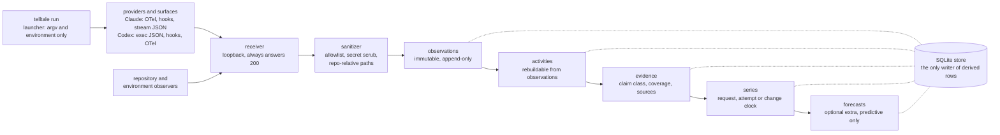

<p align="center">
  <picture>
    <source media="(prefers-color-scheme: dark)" srcset="docs/assets/wordmark-dark.svg">
    
  </picture>
</p>

<p align="center">
  A flight recorder for coding agents. Every number carries its claim class.
</p>

<p align="center">
  <a href="https://github.com/0xfauzi/telltale/actions/workflows/ci.yml"></a>
  
  
  
  
  
  <a href="LICENSE"></a>
</p>

A telltale is a short length of yarn a sailor tapes to a sail. You cannot see the wind, so
you read the yarn instead. This project does the same thing for a coding agent: you cannot
see what the agent was doing, so it reads the traces the agent already emits.

## What Telltale is

Telltale records what a coding agent did, from the surfaces the agent already exposes. It
launches Claude Code or Codex for you, listens on a loopback port for the OpenTelemetry
logs and metrics, the lifecycle hooks and the structured stream output those tools already
produce, and adds its own observations of the repository and the execution environment. No
model traffic is intercepted and no global configuration is edited: the settings that
switch capture on travel with the launched process and disappear when it exits.

It keeps facts, not content. A tool name, a token count, a repo-relative path, a
normalized command, a diff statistic, a compaction event and an exit code are facts. The
prompt, the assistant's reply, the contents of an edit, the output of a command and the
value of an environment variable are content, and none of them is written at any capture
level. What survives is enough to reconstruct what happened and not enough to reconstruct
what was said.

Every derived number carries a claim class, so nobody downstream can present it as
stronger evidence than the layer that produced it. `derived` means computed from this
capture's own observations. `comparative` means two captures, or a capture and a cohort,
placed side by side. `associative` means two things moved together, which is not a
statement about cause. `predictive` means a forecaster produced it. A claim class is never
upgraded, a report may narrow a claim or drop it, and a value that was never observed
stays unknown rather than becoming zero, so "no compactions happened" and "this surface
cannot see compaction" remain different answers.

## What it is not

- Not a quality score, a difficulty score, or any other hidden latent label for a session,
  a change or a module. There is no `quality_score` and no `difficulty_score` anywhere.
- Not a causal system. Ordinary observational capture supports no causal claim, and the
  words cause, impact and would are refused in forecast output.
- Not a prompt or code archive. Prompt text, assistant text, tool result bodies, edit
  contents, command output and environment variable values are never persisted.
- Not a proxy or an interceptor. Telltale never sits between the agent and the model, and
  never reads model traffic.
- Not a cloud service. One local process, a SQLite file, and nothing leaves the machine.

## Quickstart

Two commands exist today. Anything below that does not yet exist is marked with the wave
that ships it.

```console
$ uv sync
$ uv run telltale --version
0.0.1
```

`telltale doctor` is a stub. It prints one line and exits 2, because a self-check that has
not been written must not report success. Wave 0 replaces it with a real round-trip of a
synthetic event through every receiver endpoint.

<!-- wave 0 -->

```console
$ uv run telltale doctor
doctor: not implemented
```

Wrapping a session, and reading the record back, arrive in wave 1.

<!-- wave 1 -->

```console
$ uv run telltale run --provider claude -- claude -p "add a test for the sanitizer"
$ uv run telltale show <capture-id>
```

## What gets stored and what never does

Level 1, engineering metadata, is the default. Level 0 keeps less. Level 2 adds bounded
adapter-debugging fragments in a diagnostics table with a 7 day purge, and is never
required for anything else in the system.

| Stored at level 1 | Never stored, at any level |
|---|---|
| Provider, runtime version, model, reasoning effort, sandbox posture, as values or sha256 hashes | Prompt text |
| Token and usage quantities, compaction events, session and turn boundaries | Assistant text and reasoning |
| Tool names, tool decisions and correlation ids such as `tool_use_id` and `request_id` | Tool result bodies |
| File paths, made relative to the repository root; paths elsewhere become `<outside>/<sha256 prefix>` | File and edit contents, which is `old_string`, `new_string` and `content` |
| Normalized commands: the executable basename, up to two bare subcommand tokens, and flag names with any `=value` stripped | Command output |
| Exit codes, read from a Bash result's `Exit code N` line before the text is dropped | Environment variable values |
| Diff statistics and hashes: files changed, additions, deletions, per-file patch hashes | Patch content |
| Repository identity: root hash, HEAD, branch, base SHA, remote fingerprint, dirty-tree hash | The absolute path of the repository, and the home directory in any form |

Three mechanisms enforce that table rather than describing it. Sanitization is an
allowlist, so a provider field nobody has classified is dropped and counted, not kept.
Every string that survives is scrubbed for secrets, bounded to 512 characters and the
payload to 8 KB, with any truncation and redaction recorded beside the row. Privacy
fixtures seed known fake secrets and source strings and assert that they never reach
storage.

## Claim classes

Claim class is part of the data model, not the wording of a report. The right-hand column
is the enforcement: a layer may only write the class it is entitled to.

| Class | Meaning | Who may write it |
|---|---|---|
| `observed` | A provider or Telltale itself saw this happen | The provider modules only, and never for a computed number |
| `derived` | Computed from this capture's own observations | The reducers |
| `comparative` | Two captures, or a capture and a cohort, placed side by side | The cohort code |
| `associative` | Two things moved together, which is not a statement about cause | The experiment runner |
| `predictive` | A forecaster produced it, as a conditional trajectory | The forecaster |
| `causal` | The effect of an intervention | Nobody in this repository |

## Architecture



The launcher is the only way capture is configured, so nothing outside this repository and
`$TELLTALE_HOME` is ever written. The receiver fails open: any Telltale exception during a
capture becomes a diagnostic row and never changes the child process's behaviour, output
bytes or exit code, every endpoint answers 200 whatever happened, and `/healthz` alone
tells the truth. The store holds the only INSERT statements for activities, evidence,
series snapshots and forecast runs, so the CHECK constraints on claim class and coverage
are the single door every derived number comes through.

## Documentation

`docs/README.md` is the index. The four things worth reading first:

- [`docs/spec/telltale-architecture.md`](docs/spec/telltale-architecture.md): the
  specification. What the system claims, what it refuses to claim, and the research gates.
- [`docs/design/00-digest.md`](docs/design/00-digest.md): the verified provider facts, each
  with its source, that the capture design rests on.
- [`docs/design/01-design.md`](docs/design/01-design.md): the design. Shapes, observation
  vocabulary, sanitizer, store, receiver, providers, reducers, series and CLI.
- [`AGENTS.md`](AGENTS.md): the invariants a change has to hold, and the commands that
  check them.

## Research status

Versions are research gates, from section 21 of the specification. Failure of one
hypothesis disables only the claims and layers that depend on it, and none of these gates
is assumed to pass.

- [ ] **v0.0** capture feasibility and epistemic substrate. Exit: high-value tool, file,
      command, session, usage and compaction facts are observable without unsafe content
      retention or model traffic interception.
- [ ] **v0.1** flight recorder, experiment harness and TimesFM smoke path. Exit: a
      non-trivial session can be diagnosed from Telltale alone, activities reproduce from
      observations, and the repeated-task harness exposes within-condition variance.
- [ ] **v0.2** semantic measures, stochastic bounds and request-clock forecast lab. Exit:
      H1, H2 and H3 are characterized, and measures that are too unstable are not promoted
      to cross-session comparison.
- [ ] **v0.3** outcome correlation, attempt and change clocks, temporal validity. Exit: per
      target, whether chronology matters, whether TimesFM beats deterministic baselines,
      and whether process semantics add temporal value. No requirement that the answer be
      yes.
- [ ] **v0.4** controlled repository interaction research. Exit: which repository claims
      are supportable and which remain workload analytics. No universal maintainability
      score.
- [ ] **v0.5** candidate-conditioned one-step advisory. Exit: candidate conditioning
      improves calibrated near-term prediction or warning usefulness on held-out future
      changes, or it stays a research command.
- [ ] **v0.6** scenario horizons, policy experiments and hardening. Exit: longer horizons
      only with explicit future-workload assumptions, and any advisory that starts
      influencing behaviour emits policy intervention events and is evaluated by regime.

## Licensing

The code in this repository is MIT. See [`LICENSE`](LICENSE).

The TimesFM-3 model weights are not MIT and are not distributed here. Google publishes
them under a non-commercial, non-production license, recorded in
[`pyproject.toml`](pyproject.toml) as `timesfm-non-commercial-license-v1.0`. The
forecasting stack lives behind the optional `telltale[forecast]` extra and a plain
`uv sync` does not install it, so nothing in a default installation pulls those weights.
Every forecast run records the checkpoint and its license beside its output.

## Citation

[`CITATION.cff`](CITATION.cff) holds the citation metadata. GitHub renders it as a "Cite
this repository" button on the repository page.
