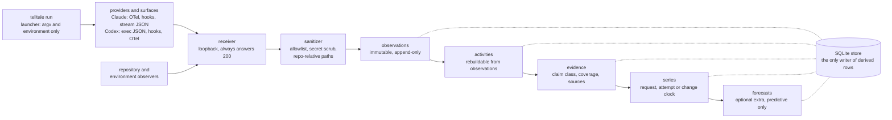

<p align="center">
  <picture>
    <source media="(prefers-color-scheme: dark)" srcset="docs/assets/wordmark-dark.svg">
    
  </picture>
</p>

<p align="center">
  A flight recorder for coding agents. Every number carries its claim class.
</p>

<p align="center">
  <a href="https://github.com/0xfauzi/telltale/actions/workflows/ci.yml"></a>
  
  
  
  
  
  <a href="LICENSE"></a>
</p>

A telltale is a short length of yarn a sailor tapes to a sail. You cannot see the wind, so
you read the yarn instead. This project does the same thing for a coding agent: you cannot
see what the agent was doing, so it reads the traces the agent already emits.

## The goal, and where it stands

Telltale asks two questions about coding agents such as Claude Code and Codex.

1. **Can what an agent did be recorded safely?** Every tool call, file touched, command
   run, test result, token spent, compaction and commit, without keeping the prompt, the
   reply, the file contents or the command output, and without editing any global
   configuration or intercepting model traffic.
2. **Can what happens next be predicted early enough to act on?** How much a session will
   spend, whether a test run will fail, whether a change will need rework after it merges,
   and whether the agent is about to spin without making progress.

**State on 2026-09-08.** Question 1 is answered yes and the recorder is complete: six
research gates are met (v0.0 to v0.6 below), 1,841 Claude and 1,459 Codex sessions were
imported from disk, and the build recorded itself.

Question 2 has one answer so far: **the one-line baselines are sufficient nearly
everywhere it has been asked.**

| What was asked | Answer |
|---|---|
| Per-request token amounts, 596 backtests over 594 Claude sessions (E07, E13) and every Codex session (E13b) | Baseline sufficient on every pooled row. Shuffling a session's history barely changed the errors (E08), so the order carries little information. This is a result about the target, not the model. |
| Post-merge outcomes on 657 first-parent commits across four repositories (E16) | Baseline sufficient on all 12 (repository, target) rows. TimesFM-3's best win share was 0.5308 against the pre-registered 0.60. |
| Does a candidate change's own diff condition that forecast (H8, E16) | 1 of 11 rows moved under the pre-registered rule, 10 read "no measurable conditioning at this n", 1 was not assessable. Carried forward, not built on. |
| Is a session's level of spend knowable early (E15) | Yes. After 16 requests, remaining output tokens are estimable out of fold with 44 percent less error than the null, rank correlation 0.70, typical miss a factor of three. |
| Do failures cluster (E15) | Yes. After a failed verification the next fails 30 percent of the time against 3 percent otherwise; the next activity kind is predictable with an 18 percent log-loss reduction. Neither yet clears the bar for a warning. |

**The open question, and why the daemon is running.** H7 asks whether the agent's own
process (tokens, compactions, verification cycles) says anything about what happens after
its change lands. It has never been assessable, because the process columns exist on 5 of
657 change rows: the rest came from git history, not from a captured session. Only a
captured session supplies them, and they cannot be backfilled. Day-to-day capture was
switched on 2026-09-06 and the daemon has been a launchd agent since 2026-09-07, so every
session that commits inside a git checkout now adds a change row with its process half
known. That accrual is the whole point of leaving it running, and the experiment waiting
on it is [E17](docs/experiments/E17.md), which states the bar (36 rows on one repository)
before any row is scored.

The full report is [`docs/gates/final-report.md`](docs/gates/final-report.md); each
experiment's decision file is under [`docs/experiments/`](docs/experiments/).

## What Telltale is

Telltale records what a coding agent did, from the surfaces the agent already exposes. It
launches Claude Code or Codex for you, listens on a loopback port for the OpenTelemetry
logs and metrics, the lifecycle hooks and the structured stream output those tools already
produce, and adds its own observations of the repository and the execution environment. No
model traffic is intercepted and no global configuration is edited: the settings that
switch capture on travel with the launched process and disappear when it exits.

It keeps facts, not content. A tool name, a token count, a repo-relative path, a
normalized command, a diff statistic, a compaction event and an exit code are facts. The
prompt, the assistant's reply, the contents of an edit, the output of a command and the
value of an environment variable are content, and none of them is written at any capture
level. What survives is enough to reconstruct what happened and not enough to reconstruct
what was said.

Every derived number carries a claim class, so nobody downstream can present it as
stronger evidence than the layer that produced it. `derived` means computed from this
capture's own observations. `comparative` means two captures, or a capture and a cohort,
placed side by side. `associative` means two things moved together, which is not a
statement about cause. `predictive` means a forecaster produced it. A claim class is never
upgraded, a report may narrow a claim or drop it, and a value that was never observed
stays unknown rather than becoming zero, so "no compactions happened" and "this surface
cannot see compaction" remain different answers.

## What it is not

- Not a quality score, a difficulty score, or any other hidden latent label for a session,
  a change or a module. There is no `quality_score` and no `difficulty_score` anywhere.
- Not a causal system. Ordinary observational capture supports no causal claim, and the
  words cause, impact and would are refused in forecast output.
- Not a prompt or code archive. Prompt text, assistant text, tool result bodies, edit
  contents, command output and environment variable values are never persisted.
- Not a proxy or an interceptor. Telltale never sits between the agent and the model, and
  never reads model traffic.
- Not a cloud service. One local process, a SQLite file, and nothing leaves the machine.

## Quickstart

Every command below is real, run in order in a fresh clone under a temporary `HOME` and
`TELLTALE_HOME`; nothing is invented or assumed to still work.

```console
$ uv sync
$ uv run telltale --version
0.0.1
```

`telltale doctor` round-trips a synthetic event through every receiver endpoint and reports
what came back, rather than assuming success:

```console
$ uv run telltale doctor
SURFACE               RESULT  OBSERVED
--------------------  ------  -------------------------
otel_logs              ok     claude.otel.api_request
otel_metrics           ok     claude.otel.metric
hook                   ok     claude.hook.SessionEnd
stream                 ok     claude.stream.system.init
correlations           ok     external.correlation
outcomes               ok     external.outcome
policy_interventions   ok     policy.intervention
daemon_port            ok     port 47311 free

doctor: 8 surfaces round-trip
```

`telltale run` launches any command after `--`, wraps it with a capture, and never changes
its output bytes or its exit code. The same command wraps `claude -p ...` or
`codex exec ...`; here it wraps `bash`, so this transcript needs no agent session and spends
no tokens:

```console
$ uv run telltale run -- bash -c 'echo hello; exit 0'
hello
$ uv run telltale sessions
CAPTURE_ID                      PROVIDER  RUNTIME  MODEL  STARTED              DURATION_MS  OBSERVATIONS  COVERAGE  COMMITS  BACKFILL
------------------------------  --------  -------  -----  -------------------  -----------  ------------  --------  -------  --------
cap_01M1Q6R92KQPHD0J7RKXAHKMTM  generic   -        -      2026-09-04 21:56:16  220          5             -        0        no
```

`telltale show` is the session summary, `telltale timeline` is its activities in order, and
`telltale explain` walks one metric back to the observations that produced it; the
capture id in each is the one `sessions` printed, and yours will differ. A `generic`
capture of a plain shell command carries no model, tool or file facts, so most fields below
read `null`: that is the unknown-stays-unknown rule working, not a bug. `show` prints every
field in "What gets stored" below; this is an abridged excerpt of real output, not the
whole object.

```console
$ uv run telltale show cap_01M1Q6R92KQPHD0J7RKXAHKMTM
{
  "capture_id": "cap_01M1Q6R92KQPHD0J7RKXAHKMTM",
  "session": {"provider": "generic", "models": null, "duration_ms": 120.034},
  "usage": {"model_requests": null, "output_tokens": null},
  "work": {"max_diff_lines": 0, "final_diff_lines": 0},
  "claim_class": "derived"
  ...
}
$ uv run telltale timeline cap_01M1Q6R92KQPHD0J7RKXAHKMTM
TIME  TYPE           ACTOR     NAME           DURATION_MS  OUTCOME  CLAIM
----  -------------  --------  -------------  -----------  -------  -------
-     lifecycle      telltale  capture        -            -        derived
-     lifecycle      agent     capture_start  -            -        derived
-     repo_snapshot  telltale  capture_end    -            -        derived
-     lifecycle      agent     capture_end    -            ok       derived
$ uv run telltale explain cap_01M1Q6R92KQPHD0J7RKXAHKMTM max_diff_lines
metric           max_diff_lines
value            0 lines
claim_class      derived
coverage         observed
sources          1
```

### Day-to-day capture

`telltale run` wraps a session you launch. For the sessions you start yourself, run the
receiver and paste the snippets:

```console
$ uv run telltale setup claude --print
$ uv run telltale setup codex --print
$ uv run telltale daemon
```

`setup` only prints; `--apply` refuses, because Telltale never edits a file outside this
repository and `$TELLTALE_HOME`. You paste the snippet into your own configuration. A
session started inside a git checkout binds to that repository, and the commits it makes
are linked at session end. On the reference machine the daemon runs as a launchd agent
(`com.telltale.daemon`, port 47311, logs in `~/.telltale/daemon.log`), which is what keeps
E17's rows accruing. [`docs/design/03-capture-howto.md`](docs/design/03-capture-howto.md)
has the whole path, including how to delete what was stored.

Forecasting is a separate, optional research lab behind the `telltale[forecast]` extra,
which a plain `uv sync` does not install: `telltale series build`, `telltale forecast
backtest|readiness|placebo|ablate|candidate|scenario` compile a stored history into a
`Series` and backtest it against deterministic baselines and TimesFM-3. Every forecast run
records its checkpoint beside the license it was made under,
`timesfm-non-commercial-license-v1.0`, and the words cause, impact and would never appear
in its output.

## Commands

`telltale --help` lists these 23 subcommands; each line below is that subcommand's own
one-line description, copied from the same `--help`, not invented.

| Command | What it does |
|---|---|
| `doctor` | round-trip one record through every capture surface |
| `setup` | print the configuration snippet for a provider |
| `run` | run a command and record it (argv after `--`) |
| `daemon` | serve the capture receiver in the foreground on a fixed port |
| `experiment` | run an experiment from a spec (design 6.12) |
| `purge` | delete one capture, or diagnostics older than N days |
| `resanitize` | rewrite stored commands through the current rules |
| `import` | read sessions the provider already wrote (design 6.3) |
| `sessions` | list the captures on this disk |
| `timeline` | the activities of one capture |
| `show` | the session summary as JSON |
| `explain` | one metric, back to its observations |
| `rebuild` | recompute activities and evidence |
| `vector` | the spec 13.7 evidence vector |
| `compare` | two evidence vectors side by side |
| `outcome` | record what happened to one attempt (design 6.3) |
| `intervention` | record that a policy acted on an advisory (spec 14.6) |
| `advise` | the shadow advisory for one candidate (spec 14.6) |
| `export` | write every table to DIR (design 6.13) |
| `schema` | the allowlist and the durable shapes as JSON |
| `series` | compile and check forecast inputs |
| `forecast` | backtest a stored series |
| `profile` | one repository's natural history, by week or subsystem |

## What gets stored and what never does

Level 1, engineering metadata, is the default. Level 0 keeps less. Level 2 adds bounded
adapter-debugging fragments in a diagnostics table with a 7 day purge, and is never
required for anything else in the system.

| Stored at level 1 | Never stored, at any level |
|---|---|
| Provider, runtime version, model, reasoning effort, sandbox posture, as values or sha256 hashes | Prompt text |
| Token and usage quantities, compaction events, session and turn boundaries | Assistant text and reasoning |
| Tool names, tool decisions and correlation ids such as `tool_use_id` and `request_id` | Tool result bodies |
| File paths, made relative to the repository root; paths elsewhere become `<outside>/<sha256 prefix>` | File and edit contents, which is `old_string`, `new_string` and `content` |
| Normalized commands: the executable basename, up to two bare subcommand tokens, and flag names with any `=value` stripped | Command output |
| Exit codes, read from a Bash result's `Exit code N` line before the text is dropped | Environment variable values |
| Diff statistics and hashes: files changed, additions, deletions, per-file patch hashes | Patch content |
| Repository identity: root hash, HEAD, branch, base SHA, remote fingerprint, dirty-tree hash | The absolute path of the repository, and the home directory in any form |

Three mechanisms enforce that table rather than describing it. Sanitization is an
allowlist, so a provider field nobody has classified is dropped and counted, not kept.
Every string that survives is scrubbed for secrets, bounded to 512 characters and the
payload to 8 KB, with any truncation and redaction recorded beside the row. Privacy
fixtures seed known fake secrets and source strings and assert that they never reach
storage.

## Claim classes

Claim class is part of the data model, not the wording of a report. The right-hand column
is the enforcement: a layer may only write the class it is entitled to.

| Class | Meaning | Who may write it |
|---|---|---|
| `observed` | A provider or Telltale itself saw this happen | The provider modules only, and never for a computed number |
| `derived` | Computed from this capture's own observations | The reducers |
| `comparative` | Two captures, or a capture and a cohort, placed side by side | The cohort code |
| `associative` | Two things moved together, which is not a statement about cause | The experiment runner |
| `predictive` | A forecaster produced it, as a conditional trajectory | The forecaster |
| `causal` | The effect of an intervention | Nobody in this repository |

## Architecture



The launcher is the only way capture is configured, so nothing outside this repository and
`$TELLTALE_HOME` is ever written. The receiver fails open: any Telltale exception during a
capture becomes a diagnostic row and never changes the child process's behaviour, output
bytes or exit code, every endpoint answers 200 whatever happened, and `/healthz` alone
tells the truth. The store holds the only INSERT statements for activities, evidence,
series snapshots and forecast runs, so the CHECK constraints on claim class and coverage
are the single door every derived number comes through.

## Documentation

[`docs/README.md`](docs/README.md) is the index. The things worth reading first:

- [`docs/spec/telltale-architecture.md`](docs/spec/telltale-architecture.md): the
  specification. What the system claims, what it refuses to claim, and the research gates.
- [`docs/design/00-digest.md`](docs/design/00-digest.md): the verified provider facts, each
  with its source, that the capture design rests on.
- [`docs/design/01-design.md`](docs/design/01-design.md): the design. Shapes, observation
  vocabulary, sanitizer, store, receiver, providers, reducers, series and CLI.
- [`AGENTS.md`](AGENTS.md): the invariants a change has to hold, and the commands that
  check them.
- [`docs/gates/`](docs/gates/): one report per wave, each closing with whether that
  version's spec section 21 exit criterion was met.
- [`docs/experiments/`](docs/experiments/): one write-up per experiment, decision rule
  first, raw numbers cited by path.

## Research status

Versions are research gates, from section 21 of the specification. Failure of one
hypothesis disables only the claims and layers that depend on it, and none of these gates
is assumed to pass.

- [x] **v0.0** capture feasibility and epistemic substrate. Met:
      [`docs/gates/wave-0.md`](docs/gates/wave-0.md). Tool, file, command, session, usage
      and compaction facts are observable without unsafe content retention or model
      traffic interception.
- [x] **v0.1** flight recorder, experiment harness and TimesFM smoke path. Met:
      [`docs/gates/wave-1.md`](docs/gates/wave-1.md). A non-trivial session is diagnosed
      from Telltale alone, activities reproduce from observations, and the repeated-task
      harness exposes within-condition variance.
- [x] **v0.2** semantic measures, stochastic bounds and request-clock forecast lab. Met:
      [`docs/gates/wave-2.md`](docs/gates/wave-2.md). H1, H2 and H3 are characterized, and
      measures too unstable for cross-session comparison are named rather than promoted.
- [x] **v0.3** outcome correlation, attempt and change clocks, temporal validity. Met:
      [`docs/gates/wave-3.md`](docs/gates/wave-3.md). Every forecast claim is labelled
      temporal evolution, conditional prediction, baseline sufficient or not assessable,
      with the inequalities shown.
- [x] **v0.4** controlled repository interaction research. Met:
      [`docs/gates/wave-4.md`](docs/gates/wave-4.md). States, per claim, which repository
      claims are supportable and which remain workload analytics; no universal
      maintainability score exists.
- [ ] **v0.5** candidate-conditioned one-step advisory.
      [`docs/gates/wave-5.md`](docs/gates/wave-5.md): "Not met, and the answer is the one
      the spec allows: 'otherwise keep it a research command'." `forecast candidate` stays
      a research command and the shadow advisory stays shadow.
- [x] **v0.6** scenario horizons, policy experiments and hardening. Met for everything the
      plan put in wave 6: [`docs/gates/wave-6.md`](docs/gates/wave-6.md). Longer horizons
      require an explicit future-workload path, and a policy intervention on an advisory
      is recorded and segments evaluation by regime. The spec's exporter/plugin SDK, local
      web UI and app-server coverage were not attempted.

### Forecasting findings so far

| experiment | question | answer |
|---|---|---|
| [E07](docs/experiments/E07.md) | Does TimesFM-3 beat four one-line baselines on per-request tokens, 21 build sessions? | No: 19 labels, all baseline sufficient. |
| [E08](docs/experiments/E08.md), [E08b](docs/experiments/E08b.md) | Does the order of a session's history carry information (chronology placebo)? | Barely: the placebo control did not separate true order from shuffled. |
| [E11](docs/experiments/E11.md) | Does a candidate change's own features change the post-merge forecast? | Not assessable: 0 forecast windows on every target. |
| [E13](docs/experiments/E13.md) | Same as E07 over every Claude session on disk (545 imports and 49 build sessions with 32 or more requests)? | No: 583 of 596 runs and every pooled row baseline sufficient; median skill 0.011 at H = 1 and 0.030 at H = 4. |
| [E15](docs/experiments/E15.md) | Which questions have out-of-fold skill: verification failure, command failure, remaining spend, next activity? | Remaining spend and next activity clear their bars; the two failure tasks rank but do not call. |
| [E13b](docs/experiments/E13b.md) | Same question on the Codex population: 781 captures, 2,005 triples, 289,373 windows. | No: baseline sufficient on every pooled row, one of them by 0.009 of win share. |
| [E16](docs/experiments/E16.md) | Post-merge verification and rework on 657 git-backfilled commits, four repositories, never pooled. | Baseline sufficient on all 12 rows; conditioning moved 1 of 11 readable rows. |
| [E17](docs/experiments/E17.md) | Do a captured session's process columns add information about what happens after its change lands (H7)? | Open. Rule pre-registered, waiting on 36 change rows with process columns on one repository. |

## Licensing

The code in this repository is MIT. See [`LICENSE`](LICENSE).

The TimesFM-3 model weights are not MIT and are not distributed here. Google publishes
them under a non-commercial, non-production license, recorded in
[`pyproject.toml`](pyproject.toml) as `timesfm-non-commercial-license-v1.0`. The
forecasting stack lives behind the optional `telltale[forecast]` extra and a plain
`uv sync` does not install it, so nothing in a default installation pulls those weights.
Every forecast run records the checkpoint and its license beside its output.

## Citation

[`CITATION.cff`](CITATION.cff) holds the citation metadata. GitHub renders it as a "Cite
this repository" button on the repository page.
